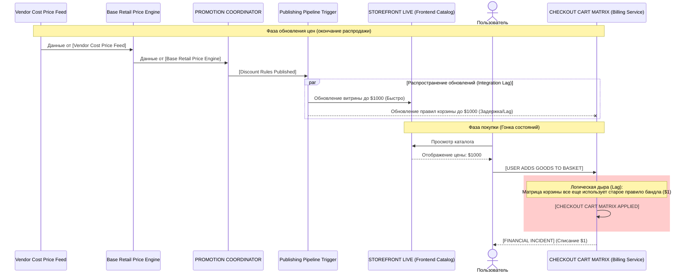
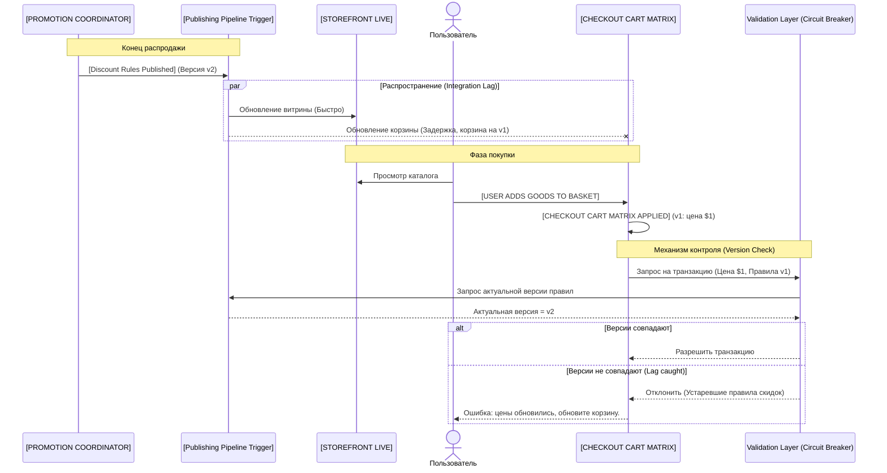
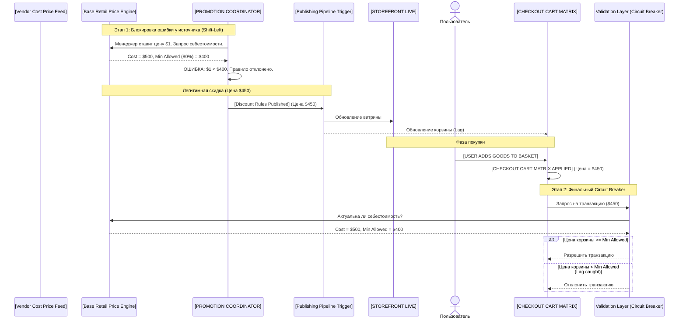

# E-Commerce Architecture Challenge: "The Accidental Black Friday"

## Оглавление (Соответствие требованиям ТЗ)
В данном решении последовательно проработаны все требования технического задания:
1. [The Architecture Loop (AS-IS)](#пункт-1-the-architecture-loop) — Моделирование текущей архитектуры, выявление "узких мест" и объяснение причин Integration Lag.
2. [The Control Mechanism (TO-BE)](#пункт-2-the-control-mechanism) — Проектирование двух вариантов автоматизированного Circuit Breaker (Rule Version Validation и Shift-Left Margin Validation).
3. [The AI Prompt-Log](#пункт-3-the-ai-prompt-log-опыт-взаимодействия-с-ии) — Лог итеративного взаимодействия с ИИ при решении задачи.

---

## Вводный анализ (Разбор неопределенностей)
В текстовом описании причиной инцидента названа: *«integration lag between the Billing Service and the Frontend Catalog»*. 
Однако на исходной схеме AS-IS **Billing Service полностью отсутствует**. Мы намеренно не стали додумывать недостающие в схеме элементы (вроде внешних OMS или финансовых процессоров). Опираясь строго на AS-IS data flow, мы делаем вывод: автор подразумевает под термином "Billing Service" саму расчетную логику корзины (`[CHECKOUT CART MATRIX APPLIED]`), а под "Frontend Catalog" — `[STOREFRONT LIVE]`.

---

## Пункт 1: The Architecture Loop
**Задача:** Нарисовать AS-IS диаграмму. Найти гонку состояний (race condition) или логическую ошибку, которая позволила продать бандл за $1.

### AS-IS Диаграмма (Sequence Diagram)
На диаграмме проиллюстрирована **рассинхронизация**, при которой витрина (`STOREFRONT LIVE`) обновила цены после окончания распродажи быстрее, чем кэш правил корзины (`CHECKOUT CART MATRIX`), из-за чего возникла задержка интеграции (integration lag).

### Описание Race Condition (Гонки состояний)

**Суть уязвимости:** Архитектура AS-IS не имеет синхронной сверки цен перед финальным действием (`[FINANCIAL INCIDENT]`). 
Возникает временное окно (race condition), в которое витрина уже показывает пользователю корректную цену без скидки ($1000). Но если пользователь в этот момент переходит к оформлению заказа, отстающая матрица корзины применяет свои локальные, устаревшие правила скидок и отдает бандл за $1.

**Природа лага (Почему корзина отстает от витрины):**
В ТЗ явно указано наличие сложной логики: *«Bundle rules»* (комплекты) и *«Stackable percentage rules»* (наслаиваемые скидки). Из-за этого `[CHECKOUT CART MATRIX]` — это не просто калькулятор суммы, а сложный движок. Чтобы не тормозить на чекауте, эта матрица вынуждена иметь **свою базу данных / кэш** предрассчитанных правил или состояний. 
Когда акция заканчивается, обновить "плоскую" цену на витрине `[STOREFRONT LIVE]` — это быстрый процесс. А вот инвалидировать и обновить кэш сложной матрицы пересекающихся правил — долгий. Именно этот процесс порождает `Integration Lag`.

**Скрытая угроза наслаивания (Stacking Risks):**
Наличие *«Stackable percentage rules»* делает систему экстремально хрупкой. Если маркетологи случайно создадут два наслаиваемых правила по 50%, товар уйдет за $0. Это подчеркивает, что проблема не только в лаге сети, но и в отсутствии жестких бизнес-ограничений (circuit breakers) на стороне самой корзины.

*(Альтернативный вариант, когда витрина зависла на $1, а корзина уже обновилась до $1000, привел бы к антипаттерну "Слепое доверие фронтенду" со стороны корзины. В нормально функционирующей архитектуре это невозможно, поэтому отставание кэша корзины — единственный логически стройный сценарий инцидента).*

---

## Пункт 2: The Control Mechanism
**Задача:** Спроектировать автоматизированный "circuit breaker" или дополнительный слой валидации. Описать TO-BE с помощью Sequence Diagram.

В соответствии с требованиями ТЗ, ниже представлены **два варианта** реализации автоматизированного механизма контроля (Circuit Breaker).

### Вариант 1: Синхронная проверка версионности (Rule Version Validation) - *Оптимальный*
**Суть (Защита Loss Leaders):** Бизнес-реалии таковы, что магазин может *намеренно* продавать товары в убыток (doorbusters, loss leaders в Черную Пятницу). Если мы создадим "тупой" Circuit Breaker, который жестко блокирует любые продажи ниже себестоимости, мы сломаем маркетинговые акции. 
Поэтому оптимальный вариант — проверять не деньги, а **версионность (актуальность) данных**. 
Каждое обновление от `[PROMOTION COORDINATOR]` получает уникальную версию (например, v2). Корзина при расчете цены фиксирует версию правил, которую она использовала. Перед списанием средств `Validation Layer` делает легкий запрос к пайплайну или координатору и сверяет версии. Если версия в корзине устарела (из-за лага), транзакция отклоняется.

### Вариант 2: Двухуровневый контроль маржи (Shift-Left Validation)
**Суть:** Как аналитик, я признаю, что снижение порога безопасности до $1 — это костыль. Продажа товара за $1000 по цене $1 — это в 99% случаев человеческая ошибка (fat-finger error), которую система не должна пропускать в принципе.
Вместо того чтобы бороться с последствиями на чекауте, мы внедряем **защиту эшелонировано (Defense in Depth)**:
1. **На уровне создания акции (Shift-Left):** Добавляем жесткий порог `Min_Margin_Percentage` (например, 80% от себестоимости, настраивается поштучно). Когда менеджер пытается создать скидку в `[PROMOTION COORDINATOR]`, система запрашивает себестоимость у `Base Retail Price Engine`. Если итоговая цена ниже порога (например, $1 при пороге $400) — правило даже не публикуется в `Pipeline`.
2. **На уровне чекаута:** `Validation Layer` дублирует эту проверку перед списанием. Это нужно на случай, если себестоимость товара резко выросла *уже после* публикации правила скидки.

---

## Пункт 3: The AI Prompt-Log (Опыт взаимодействия с ИИ)

Вместо классического single-prompt подхода, анализ данного ТЗ проводился в формате итеративного диалога с ИИ-агентом. Роль аналитика заключалась в постановке задач, критической оценке предложенных архитектур и корректировке бизнес-логики.

### Стратегия промптинга и итерации

1. **Захват контекста и поиск проблемы (Initial Context Setting):** 
   * **Промпт:** ИИ получил сырой текст из PDF с явным указанием: *"Выступи в роли опытного системного аналитика, проанализируй текст и найди неопределенности в постановке задачи"*.
   * **Результат и анализ:** ИИ выявил `Integration Lag` и предложил два варианта развития событий (зависла витрина или зависла корзина). Второй вариант (витрина зависла на $1, а корзина обновилась) был отброшен мной как нелогичный: формулировка проблемы в ТЗ явно указывает на лаг между витриной и корзиной, поэтому "слепое доверие корзины фронтенду" в данном контексте неактуально по определению.
2. **Борьба с галлюцинациями (Adversarial Prompting):** 
   * **Промпт:** ИИ попытался усложнить схему классическими микросервисами (OMS, независимый Billing Service), которых не было в Data Flow. Был дан жесткий промпт: *"В исходной схеме нет никакого Billing Service и OMS. Схема заканчивается шагом CHECKOUT CART MATRIX APPLIED. Не придумывай лишние сущности, обоснуй лаг только на основе предоставленных данных"*.
   * **Результат и анализ:** ИИ исправил модель, приравняв `Billing Service` к расчетной логике самой матрицы корзины, что вернуло решение в строгие рамки ТЗ.
3. **Проектирование TO-BE (Architectural Design):**
   * **Промпт:** ИИ предложил простой `Circuit Breaker`, жестко блокирующий транзакции ниже себестоимости. Я указал на бизнес-ошибку: *"Это костыль. Магазин может намеренно продавать товар за $1 в Черную Пятницу (Loss Leaders). Твой механизм заблокирует легитимный маркетинг. Нужно два варианта, и нужен контроль на уровне источника"*.
   * **Результат и анализ:** На основе этих правок были спроектированы финальные варианты (Shift-Left валидация в PROMOTION COORDINATOR и проверка версионности). ИИ провалидировал эти концепции на логическую целостность и перевел их в синтаксис Mermaid-диаграмм.

### Рефлексия
ИИ выступает отличным инструментом для визуализации (мгновенная генерация Mermaid) и быстрого парсинга текста. Однако модель не обладает бизнес-чутьем реального e-commerce (склонна запрещать легитимные маркетинговые убытки) и пытается усложнить схему выдуманными сервисами. Архитектурное видение, контроль рамок ТЗ и проектирование бизнес-логики должны полностью оставаться за системным аналитиком.
