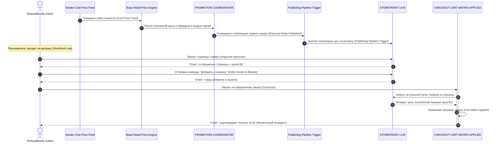

# Диаграмма последовательности AS-IS (Accidental Black Friday) — Логически дополненная

Ниже представлена визуализация текущего потока данных во времени. В отличие от строгого текста задания, здесь восстановлен пропущенный авторами технический шаг: получение данных корзины сервисом чекаута (запрос к витрине). Без этого шага система не смогла бы узнать, что базовая цена товара составляет $1.

### Легенда: связь с оригинальным текстом задания
В исходном задании цепочка AS-IS описана не действиями, а набором сущностей и состояний: `[Vendor Cost Price Feed] -> [Base Retail Price Engine] -> ...`
Вот как этот текст перекладывается на шаги (номера стрелок) нашей расширенной диаграммы:

* `[Vendor Cost Price Feed]` ➡️ **Шаг 1**: Поставщик выгружает данные о себестоимости.
* `[Base Retail Price Engine]` ➡️ **Шаг 2**: Движок принимает данные и считает розничную цену.
* `[PROMOTION COORDINATOR]` ➡️ **Шаги 2-3**: Модуль промо получает цену и подготавливает скидки.
* `[Discount Rules Published]` ➡️ **Шаг 3**: Сформированные правила скидок публикуются в пайплайн.
* `[Publishing Pipeline Trigger]` ➡️ **Шаг 4**: Пайплайн обновляет цены на живой витрине.
* `[STOREFRONT LIVE]` ➡️ **Шаги 5-6**: Состояние витрины (пользователь видит ошибочную цену $1).
* `[USER ADDS GOODS TO BASKET]` ➡️ **Шаги 7-8**: Пользователь добавляет товар в корзину на витрине.
* **[Скрытый логический шаг]** ➡️ **Шаги 10-11**: Чекаут запрашивает актуальную цену товаров из корзины у витрины.
* `[CHECKOUT CART MATRIX APPLIED]` ➡️ **Шаги 9 и 12**: Сервис чекаута принимает запрос и применяет алгоритмы скидок.
* `[FINANCIAL INCIDENT]` ➡️ **Шаг 13**: Успешное завершение ошибочной оплаты, возвращение чека пользователю.

### Архитектурные примечания

1. **Терминология (BFF):** Под сущностью **Frontend Catalog (Витрина)** подразумевается не клиентское веб-приложение (HTML/JS в браузере), а публичный бэкенд — **Backend-For-Frontend (BFF)** или публичное API каталога.
2. **Почему мы решили, что Чекаут берет цену из Витрины?** 
   В тексте задания сказано, что баг (покупка за $1 вместо $1000) стал возможен из-за задержки интеграции (lag) между Биллингом и Витриной. Если бы сервис Чекаута перед списанием денег запрашивал цену напрямую у Биллинга, то задержка на Витрине была бы лишь визуальным багом, но никак не повлияла бы на сумму чека. Тот факт, что транзакция на $1 успешно прошла, однозначно доказывает: в текущей (AS-IS) архитектуре сервис Чекаута использует в качестве источника цены кэшированные (и иногда отстающие) данные Витрины, а не синхронный ответ от Биллинга. Это доверие к отстающей системе и есть та самая логическая уязвимость (logic gap), которую нужно исправить.
