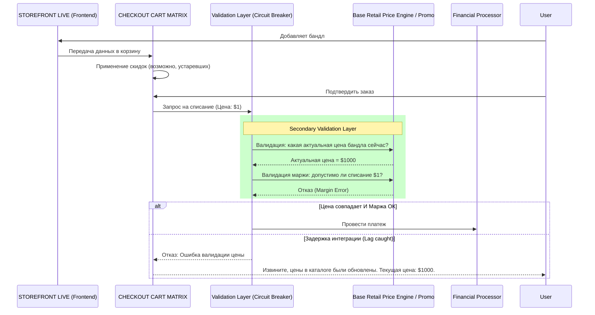

# Анализ тестового задания: Вариант 1 "The Accidental Black Friday"

При анализе данного тестового задания как системный аналитик, критически важно опираться **строго на предоставленные исходные данные** (AS-IS data flow) и не додумывать сущности, которых нет на схеме. 

Исходная схема данных:
`[Vendor Cost Price Feed] -> [Base Retail Price Engine] -> [PROMOTION COORDINATOR] -> [Discount Rules Published] -> [Publishing Pipeline Trigger] -> [STOREFRONT LIVE] -> [USER ADDS GOODS TO BASKET] -> [CHECKOUT CART MATRIX APPLIED] -> [FINANCIAL INCIDENT]`

---

## 1. Главная логическая дыра и неопределенность ТЗ

В текстовом описании причиной инцидента названа: *«integration lag between the Billing Service and the Frontend Catalog»*. 
Однако на схеме **Billing Service (сервис биллинга) полностью отсутствует**. Схема заканчивается шагом `[CHECKOUT CART MATRIX APPLIED]`, после которого сразу следует финансовый инцидент.

Опираясь исключительно на логику схемы, мы делаем вывод: автор задачи под термином "Billing Service" в тексте подразумевает логику самой корзины — блок `[CHECKOUT CART MATRIX APPLIED]` (либо это скрытый этап внутри него). А "Frontend Catalog" — это `[STOREFRONT LIVE]`.

## 2. Архитектурный цикл (Анализ AS-IS)

Как именно "integration lag" (рассинхронизация) между Витриной (Frontend) и Матрицей корзины (Checkout Cart Matrix) привел к покупке за $1? Возможны два сценария:

### Вариант А: Корзина отстает от витрины (Рассинхронизация матриц)
1. Распродажа (по $1) закончилась. `PROMOTION COORDINATOR` выпускает новые правила — вернуть цену $1000.
2. `[STOREFRONT LIVE]` (витрина) обновляется быстро. Пользователь видит на сайте цену $1000.
3. Но база правил `[CHECKOUT CART MATRIX]` обновляется с задержкой (тот самый integration lag). Там все еще висит правило "бандл = $1".
4. Пользователь кладет товар за $1000 в корзину, переходит к оформлению, и отстающая матрица скидок применяет старое правило, выставляя счет на $1. 
*(Это именно тот вариант, который вы описали — и он абсолютно корректен логически).*

### Вариант B: Витрина отстает от корзины (Слепое доверие)
1. Распродажа закончилась. `[CHECKOUT CART MATRIX]` обновила правила (знает, что цена $1000).
2. `[STOREFRONT LIVE]` (витрина) зависла и все еще показывает старый баннер "Бандл за $1".
3. Пользователь нажимает "Купить". Витрина передает в корзину payload с устаревшей ценой (например, `amount: 1.00`).
4. Матрица корзины имеет критическую уязвимость: она слепо доверяет цене, пришедшей с фронтенда, не пересчитывая ее по своим (уже обновленным) правилам. Итог — списание $1.

В обоих случаях нарушен базовый принцип: **отсутствует единый, синхронный источник правды (Source of Truth) в момент совершения транзакции**.

---

## 3. Механизм контроля (Проектирование TO-BE)

Чтобы предотвратить подобные инциденты, необходимо устранить зависимость итоговой транзакции от рассинхронизированных компонентов (витрины и кэша корзины).

### Оптимальное решение: Синхронный шлюз валидации (Circuit Breaker)

**Механизм:** 
Мы внедряем дополнительный шаг (Secondary Validation Layer) непосредственно перед финансовым списанием. Этот слой не доверяет ни витрине, ни промежуточному кэшу корзины. Он делает синхронный запрос к источнику истины — `[Base Retail Price Engine]` или `[PROMOTION COORDINATOR]`, чтобы проверить актуальность цены на текущую миллисекунду, а также проверяет маржинальность.

### Диаграмма последовательности TO-BE

## 4. Заключение

Анализ строго по предоставленной схеме показывает, что автор задачи смешал понятия, назвав логику корзины (или следующий за ней шаг) "сервисом биллинга". Главная уязвимость системы AS-IS заключается в том, что рассинхронизация между витриной и корзиной приводит к финансовым операциям на основе устаревших данных. 
Внедрение слоя **Secondary Validation Layer** полностью нивелирует проблему "integration lag", так как финальная проверка опирается на первоисточник цен, блокируя любые аномальные транзакции (в том числе $1 вместо $1000).
